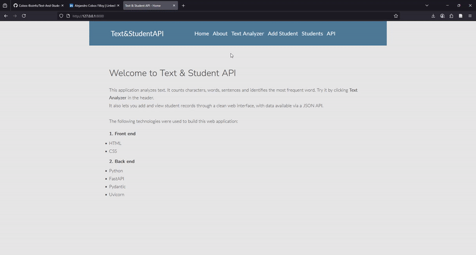

# Text & Student API

A clean, simple and responsive web application built with **Python**, **FastAPI** and **Jinja2 templates**

## 📖 Project Origin
This project began as my attempt to complete the [**Day 29**](https://github.com/Cobos-Bioinfo/30-Days-Of-Python-Solutions/tree/main/29_Building_API) exercise from the [30 Days of Python](https://github.com/Asabeneh/30-Days-Of-Python) challenge, which focused on building a simple Flask app and deploying it to Heroku.

However, I quickly found myself drifting far beyond the original scope. Instead of Flask, I chose to build with **FastAPI** for its modern features, performance, and automatic API documentation. I also decided to keep all data storage local, avoiding the need to create external accounts for services like Heroku or MongoDB. This allowed me to focus purely on the code and create a self-contained, locally-run learning environment.
## 🌟 Features

- **Interactive Text Analyzer**: Analyzes character count, word count, sentence count, and most frequent words.
- **Student Management System**: Add and view students via a user-friendly form; data accessible via JSON API.
- **Responsive Design**: Clean layout that works on desktop and mobile.
- **Polished UI**: Carefully styled forms, buttons, and typography for a professional look.
- **Dual Interface**:
  - User-friendly HTML forms for web visitors.
  - RESTful JSON API endpoint for developers.



## 🚀 Live Pages

| Page | Description |
|------|-------------|
| [`/`](http://127.0.0.1:8000) | Home page with tech stack breakdown |
| [`/about`](http://127.0.0.1:8000/about) | About Us page |
| [`/post`](http://127.0.0.1:8000/post) | Text Analyzer with input and processing |
| [`/students`](http://127.0.0.1:8000/students) | Form to add a new student |
| [`/students/list`](http://127.0.0.1:8000/students/list) | View all students (HTML) |
| [`/api/students/`](http://127.0.0.1:8000/api/students/) | JSON API endpoint (opens in new tab) |

## 🛠️ Technologies Used

- **Backend**: FastAPI (Python)
- **Frontend**: HTML5, CSS3, Jinja2 Templates
- **Styling**: Pure CSS with responsive design
- **Data Handling**: In-memory list (persists during runtime)

## 📁 Project Structure
```bash
TextAndStudentAPI/
│
├── main.py
├── static/
│   └── css/
│       └── main.css
├── templates/
│   ├── layout.html           # Base template with shared header
│   ├── home.html
│   ├── about.html
│   ├── post.html             # Text Analyzer form
│   ├── result.html           # Analysis results
│   └── add_student.html      # Add Student form
├── requirements.txt
└── README.md
```


## 💡 Key Functionalities

### 🔹 Text Analyzer
- Counts characters, words, and sentences.
- Identifies the most frequent word.

### 🔹 Student Management
- **Add Student Form**:
  - Clean, vertical layout with labels above inputs.
  - Fields: Name, DOB (with calendar input), Country, City, Skills, Bio.
  - Date input uses native `type="date"` for calendar popup.
- **View Students**:
  - `/students/list` shows all students in a styled HTML list.
  - `/api/students/` exposes data as JSON (opens in new tab via `target="_blank"`).

### 🔹 Navigation
- Header includes:
  - Home
  - About
  - Text Analyzer
  - Add Student
  - API (opens in new tab)
- All links use consistent styling and hover effects.

## 🚀 How to Run

1. **Install dependencies**:
   ```bash
   pip install -r requirements.txt
   ```
2. **Run the server**: 
   ```bash
   uvicorn main:app --reload
   ```
   or
   ```bash
   fastapi dev main.py
   ```

3. **Open as localhost**:
http://127.0.0.1:8000  
     

### 📝 Notes 
- Data is stored in memory students: `list[Student]` resets on server restart.
- No database used (lightweight demo).
- CSS is hand-written with no external frameworks.
- I may end up adding more functionalities at some point in the future.
- Designed for learning and testing.
